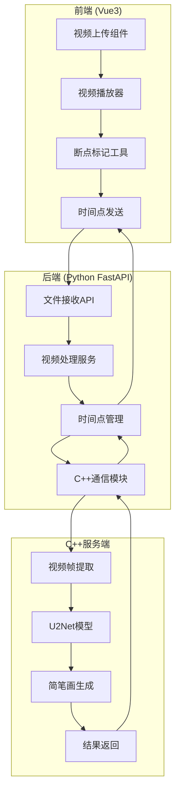

# DoodleSketchAI 架构设计

## 项目概述
DoodleSketchAI 是一个基于AI的视频简笔画生成工具，支持用户上传视频、选择关键时间点，并自动生成对应帧的简笔画。

## 系统架构



## 技术栈详细设计

### 1. 前端 (Vue3)
- **框架**: Vue 3 + TypeScript
- **UI组件库**: Element Plus / Ant Design Vue
- **视频处理**: Video.js 或原生 HTML5 Video
- **状态管理**: Pinia
- **HTTP客户端**: Axios
- **构建工具**: Vite

**核心功能模块**:
- 视频文件上传 (支持 MP4, AVI, MOV 等格式)
- 视频播放器控制 (播放/暂停/进度条)
- 时间断点标记 (点击或拖拽添加标记点)
- 断点管理 (编辑/删除/排序断点)
- 结果展示 (简笔画图片预览和下载)

### 2. 后端 (Python FastAPI)
- **框架**: FastAPI + Uvicorn
- **数据库**: Mysql(docker)
- **ORM**: SQLAlchemy
- **文件存储**: 本地文件系统 / MinIO
- **图像处理**: Pillow, OpenCV
- **进程通信**: gRPC / HTTP

**API设计**:
```
POST /api/videos/upload          # 上传视频
GET  /api/videos/{video_id}       # 获取视频信息
POST /api/videos/{video_id}/breakpoints  # 添加断点
GET  /api/videos/{video_id}/breakpoints  # 获取断点列表
POST /api/videos/{video_id}/generate     # 生成简笔画
GET  /api/tasks/{task_id}/status         # 查询任务状态
GET  /api/tasks/{task_id}/result         # 获取生成结果
```

### 3. C++服务端
- **框架**: gRPC Server / HTTP Server (Crow/Pistache)
- **视频处理**: FFmpeg + OpenCV
- **AI模型**: U2Net (人像分割) + 简笔画生成模型
- **模型推理**: ONNX Runtime / libtorch
- **并发处理**: ThreadPool

**核心功能**:
- 视频帧精确提取
- 图像预处理 (缩放/归一化)
- U2Net人像分割
- 简笔画风格化处理
- 结果图像优化和输出

## 数据流设计

1. **视频上传流程**:
   ```
   前端 → 后端API → 文件存储 → 数据库记录
   ```

2. **断点处理流程**:
   ```
   前端标记 → 后端记录 → C++提取帧 → AI处理 → 结果返回
   ```

3. **生成任务流程**:
   ```
   断点时间 → C++帧提取 → U2Net分割 → 简笔画生成 → 前端展示
   ```

## 部署架构

### 开发环境
- **前端**: `npm run dev` (localhost:3000)
- **后端**: `uvicorn main:app --reload` (localhost:8000)
- **C++服务**: `./cpp_server --port 50051` (localhost:50051)

### 生产环境
- **容器化**: Docker + Docker Compose
- **反向代理**: Nginx
- **负载均衡**: 可选多实例部署
- **监控**: Prometheus + Grafana

## 性能考虑

1. **视频处理优化**:
   - 支持视频流式处理
   - 多线程帧提取
   - GPU加速 (CUDA)

2. **AI模型优化**:
   - 模型量化 (INT8)
   - 批处理优化
   - 内存池管理

3. **缓存策略**:
   - Redis缓存生成结果
   - CDN静态资源加速
   - 浏览器缓存策略

## 安全设计

1. **文件上传安全**:
   - 文件类型验证
   - 大小限制 (建议100MB)
   - 病毒扫描 (可选)

2. **API安全**:
   - JWT认证
   - 请求频率限制
   - CORS配置

3. **数据安全**:
   - 敏感数据加密
   - 定期清理临时文件
   - 访问日志记录
