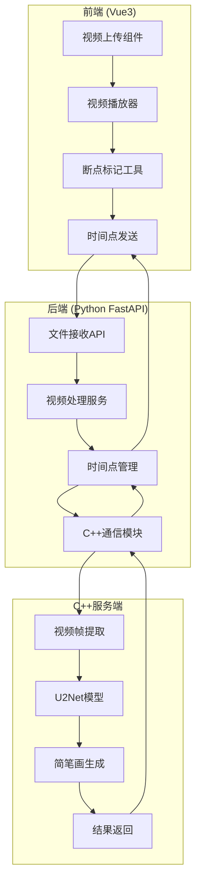

# DoodleSketchAI

AI驱动的视频简笔画生成工具，支持上传视频、选择关键时间点，并自动生成对应帧的简笔画。

## 🚀 功能特性

- 📹 **视频上传与处理**: 支持多种视频格式，自动提取视频元信息
- ⏱️ **智能断点标记**: 可视化时间轴，精确标记关键帧
- 🎨 **AI简笔画生成**: 基于U2Net人像分割和风格化算法
- 🔄 **实时进度跟踪**: WebSocket实时任务状态更新
- 📱 **响应式界面**: 基于Vue3的现代化用户界面
- 🐳 **容器化部署**: Docker Compose一键部署

## 🏗️ 系统架构



## 🛠️ 技术栈

### 前端
- **Vue 3** + TypeScript
- **Element Plus** UI组件库
- **Video.js** 视频播放器
- **Pinia** 状态管理
- **Vite** 构建工具

### 后端
- **FastAPI** + Uvicorn
- **MySQL** 数据库
- **Redis** 缓存
- **SQLAlchemy** ORM
- **gRPC** 进程间通信

### C++服务端
- **gRPC Server**
- **FFmpeg** 视频处理
- **OpenCV** 图像处理
- **ONNX Runtime** AI推理
- **U2Net** 人像分割模型

## 📦 快速开始

### 环境要求
- Docker & Docker Compose
- Node.js 16+
- Python 3.9+
- C++17 兼容编译器

### 一键启动
```bash
# 克隆项目
git clone https://github.com/hotpotWithoutHemorrhoids/DoodleSketchAI.git
cd DoodleSketchAI

# 快速启动开发环境
make quick-start
```

### 手动安装
```bash
# 1. 安装依赖
make install

# 2. 启动基础服务
make docker-up

# 3. 数据库迁移
make db-migrate

# 4. 下载AI模型
make download-models

# 5. 启动开发服务
make dev
```

### 访问地址
- 前端应用: http://localhost:3000
- 后端API: http://localhost:8000
- API文档: http://localhost:8000/docs
- 数据库: localhost:3306
- Redis: localhost:6379

## 📖 使用指南

### 1. 上传视频
1. 点击"上传视频"按钮
2. 选择支持的视频格式 (MP4, AVI, MOV等)
3. 等待上传和处理完成

### 2. 标记断点
1. 在视频播放器中播放视频
2. 在时间轴上点击添加断点
3. 可编辑断点标签和描述
4. 支持拖拽调整断点位置

### 3. 生成简笔画
1. 选择要处理的断点
2. 点击"生成简笔画"按钮
3. 实时查看处理进度
4. 下载生成的结果

## 🔧 开发指南

### 项目结构
```
DoodleSketchAI/
├── frontend/          # Vue3前端应用
├── backend/           # FastAPI后端服务
├── cpp-server/        # C++ AI处理服务
├── docker/            # Docker配置文件
├── scripts/           # 数据库和部署脚本
├── docs/              # 项目文档
├── tests/             # 测试文件
├── docker-compose.yml # 容器编排配置
└── Makefile          # 构建脚本
```

### 常用命令
```bash
# 开发环境
make dev          # 启动开发服务
make logs         # 查看服务日志
make test         # 运行测试

# 代码质量
make format       # 格式化代码
make lint         # 代码检查

# 数据库
make db-migrate   # 数据库迁移
make db-reset     # 重置数据库

# 生产部署
make build        # 构建生产版本
make deploy       # 部署到生产环境
```

### API文档
启动后端服务后，访问 http://localhost:8000/docs 查看完整的API文档。

主要API端点：
- `POST /api/videos/upload` - 上传视频
- `GET /api/videos/{id}/breakpoints` - 获取断点列表
- `POST /api/videos/{id}/breakpoints` - 添加断点
- `POST /api/videos/{id}/generate` - 生成简笔画
- `GET /api/tasks/{id}/status` - 查询任务状态

## 🧪 测试

### 运行测试
```bash
# 运行所有测试
make test

# 单独测试各模块
cd frontend && npm run test
cd backend && pytest
cd cpp-server && ./build/tests
```

### 测试覆盖率
- 前端: Jest + Vue Test Utils
- 后端: pytest + coverage
- C++: Google Test + gcov

## 🚀 部署

### Docker部署
```bash
# 生产环境部署
make deploy

# 查看服务状态
docker-compose ps

# 查看日志
docker-compose logs -f
```

### 环境配置
- 开发环境: `docker-compose.yml`
- 生产环境: `docker-compose.yml` + `docker-compose.prod.yml`

## 📊 性能优化

### 视频处理
- 多线程帧提取
- GPU加速 (CUDA)
- 流式处理支持

### AI推理
- 模型量化 (INT8)
- 批处理优化
- 内存池管理

### 缓存策略
- Redis结果缓存
- CDN静态资源
- 浏览器缓存

## 🔒 安全考虑

- 文件类型验证
- 大小限制控制
- JWT认证授权
- 请求频率限制
- 数据加密存储

## 🤝 贡献指南

1. Fork 项目
2. 创建功能分支 (`git checkout -b feature/AmazingFeature`)
3. 提交更改 (`git commit -m 'Add some AmazingFeature'`)
4. 推送到分支 (`git push origin feature/AmazingFeature`)
5. 创建 Pull Request

## 📄 许可证

本项目采用 MIT 许可证 - 查看 [LICENSE](LICENSE) 文件了解详情。

## 🙏 致谢

- [U2Net](https://github.com/xuebinqin/U-2-Net) - 人像分割模型
- [Video.js](https://videojs.com/) - 视频播放器
- [FastAPI](https://fastapi.tiangolo.com/) - 后端框架
- [Vue.js](https://vuejs.org/) - 前端框架

## 📞 支持

如果您有任何问题或建议，请：
- 创建 [Issue](https://github.com/hotpotWithoutHemorrhoids/DoodleSketchAI/issues)
- 发送邮件至: support@doodlesketchai.com
- 查看 [Wiki](https://github.com/hotpotWithoutHemorrhoids/DoodleSketchAI/wiki) 文档

---

⭐ 如果这个项目对您有帮助，请给我们一个星标！
